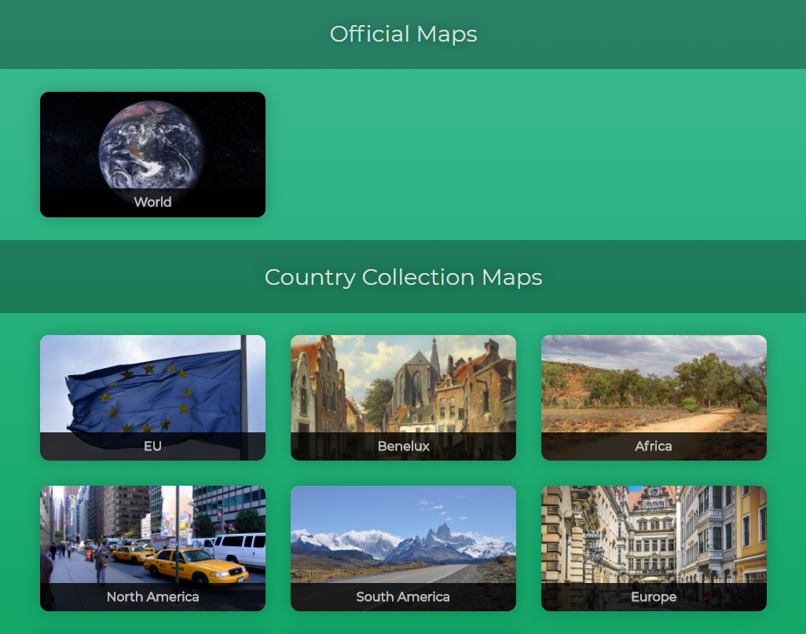
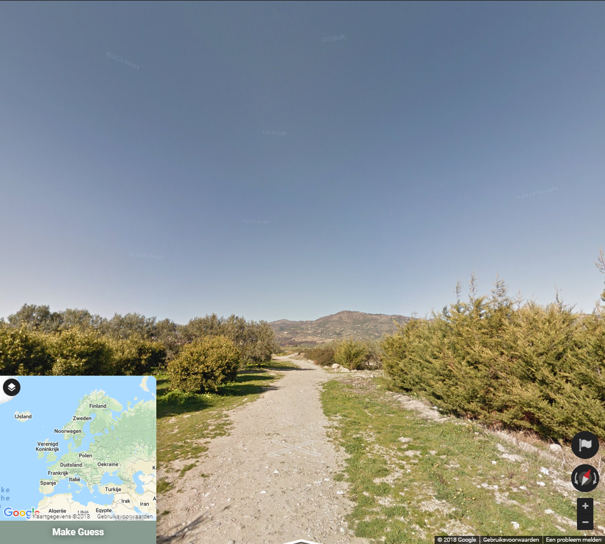
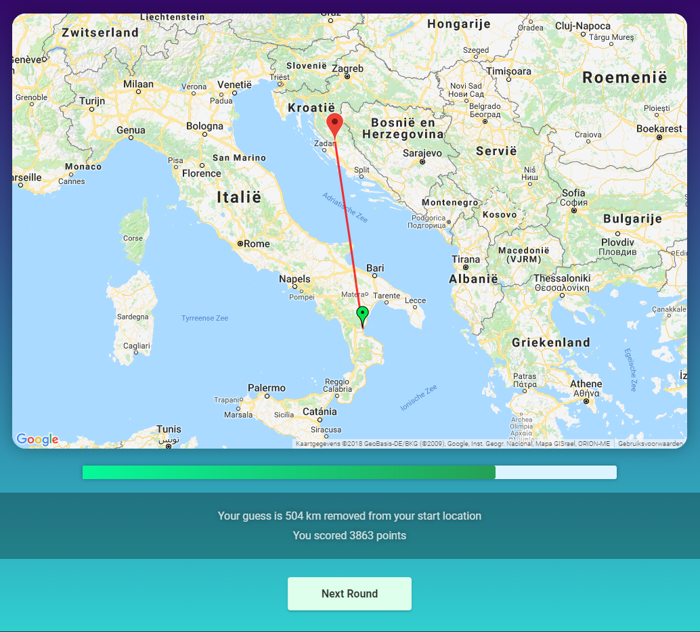

# locationestimatr.github.io
This is a game where you are put anywhere on earth, and you have to figure out where you are

## How to play

### Choose a map

### Guess where you are

### See how you did

### How to self host
1. Fork this repository to your account
2. Clone the repository
3. Replace the api key found at the bottom in /index.html and /play/index.html with your own
    * This api key can be created freely at https://console.developers.google.com/google/maps-apis/apis/maps-backend.googleapis.com
    * Your key will be at the credentials tab on the left
    * A credit card is needed to create the api key
4. Push to your Github page
5. Set up Github pages for the repository (tutorial: https://pages.github.com)
   * For __username__.github.io to work you need to name the repository __username__.github.io (as stated in the GitHub pages tutorial)
